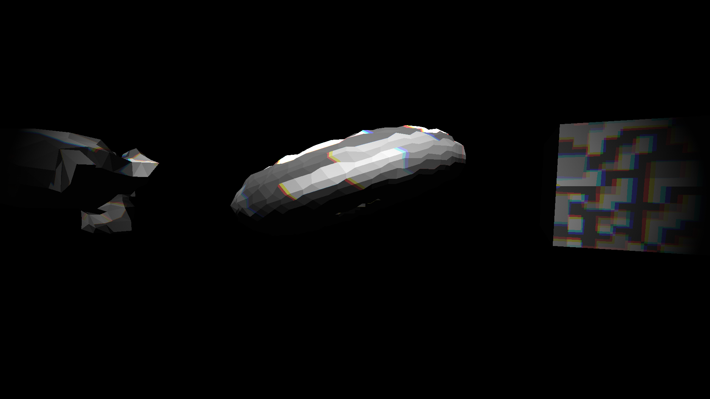

# RetCalium V-C++

## Description:
*This is a Work-in-Progress game engine that uses Modern OpenGL to render .obj files and textures in real-time with future support of Entity Component Systems and mod support*

## Planned Features:
- Map loading based on the original DOOM and Build engines that instead uses a syntax more similar to .OBJ files **(CURRENTLY IMPLEMENTING)**
- Shader effects that are fully controlable on the CPU **(FULLY IMPLEMENTED)**:
    1. Color Depth limiting (Same as PS1)
    2. Vignette with customizeable color
    3. Lambertian diffuse and Blinn-Phong shading
    4. Chromatic Aberration
- Forward+ rendering that supports multiple lights **(NOT IMPLEMENTED)**
- Built-in Entity Component System **(NOT IMPLEMENTED)**
- Built-in mod support with the previously mentioned ECS **(NOT IMPLEMENTED)**
- Map editor that comes with the engine **(CURRENTLY IMPLEMENTING)**

## Building:
- To install dependencies just run `make install`
- To build the engine just run `make`

## Using the map editor:
*Currently the map editor can't export anything and is thus far just a program that can place points and connect them. But later it will be used for making maps*
### Controls:
- LMB           = Place a free-floating point
- RMB           = Place a point that snaps to the grid in the background
- MMB           = Pan around in the workspace
- Scroll wheel  = Zoom in and out in the workspace
- Arrow up      = Move upwards in the list of points
- Arrow down    = Move downwards in the list of points
- Enter         = If Points list is selected: Choose a point for connecting **(The lines get connected when the second one is chosen)**
                  If Lines list is selected: Choose a line for connecting
- Shift + Enter = Connect the chosen lines with a section **(The two points have to be chosen *before* pressing Shift + Enter)**
- Ctrl + Enter  = Clear the list of lines to connect

- Arrow Left/Right = Change the height of the currently selected section
- Shift + Left/Right = Change the floor heiht of the currently selected section
- R             = Round the currently selected section's height to the nearest integer
- Shift+R       = Round the currently selected section's floor height to the nearest integer

### Points list:
- Blue entry    = Point
- Cyan entry    = Selected
- Red entry     = Chosen for connecting
- Pink entry    = Selected & chosen for connecting

### Lines list:
- Red entry     = Line
- White entry   = Selected Line

### Workspace:
- White dot     = Selected dot in the points list
- Green dot     = Point in the points list
- Purple dot    = Dot chosen for connecting in the points list
- Red dot       = Dot chosen for connecting & point selected in the points list

- Red line      = Line connecting two dots
- White line    = Selected Line

- Yellow Area   = Section
- White Area    = Selected Section
- Blue/Black text = Section name
